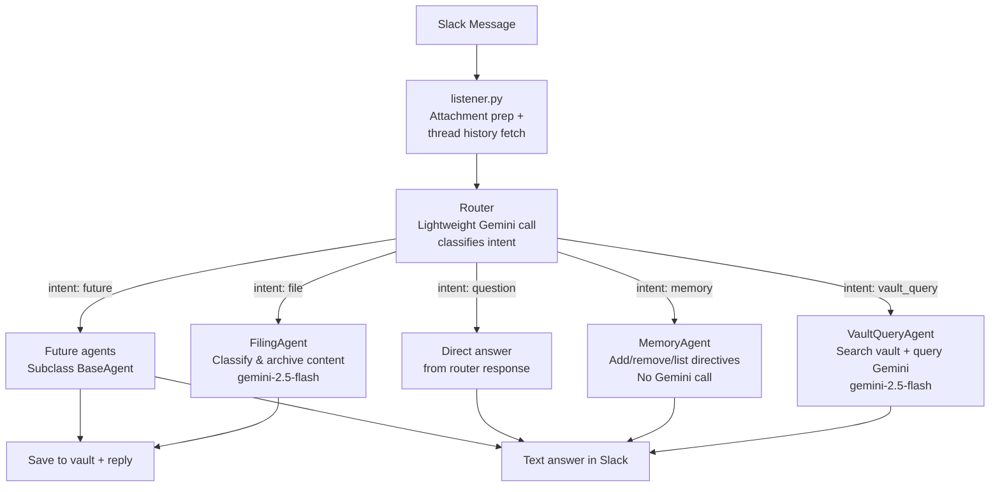

# Agent Architecture

## Overview

The 2ndBrain Collector uses a **pluggable agent architecture** to process
incoming Slack messages. A lightweight **Router** classifies each message's
intent and dispatches it to the appropriate specialist agent. This design
allows new capabilities to be added by simply subclassing `BaseAgent` and
registering the instance — the router prompt updates itself automatically.

## Message Flow



## Conversation Context (Thread Follow-ups)

When a message arrives in a Slack thread, `listener.py` automatically
fetches up to 10 prior messages via the Slack `conversations.replies`
API. These are passed as `thread_history` on `MessageContext` — a list
of `{"role": "user"|"assistant", "text": "..."}` dicts, oldest first.

Both the router and all agents include this history as a
`## Conversation History` section in their prompts, enabling natural
multi-turn conversations:

- "What YouTube videos did I file this week?" → vault query answer
- *(reply in thread)* "What about podcasts?" → the agent sees the prior
  exchange and understands "what about" means "filed this week"

Replies from the bot are always posted in-thread when the incoming
message was threaded, keeping conversations grouped.

| Property | Value |
|----------|-------|
| Storage | Slack threads (fetched via API, not stored locally) |
| Lifetime | Thread lifetime |
| Scope | Per-conversation |
| Cap | 10 most recent messages |

## Two-Stage Pipeline

### Stage 1 — Router (`agents/router.py`)

A lightweight Gemini call that reads the user's message (and text
descriptions of any attachments) and returns a JSON object identifying:

- **intent** — which agent should handle the message
- **extra data** — agent-specific fields (e.g. `search_terms`, `folders`,
  `question` for vault queries)

The router prompt (`agents/router_prompt.md`) is built dynamically: it
iterates over all registered agents and includes their `name` and
`description` in the "Available Intents" section. Adding a new agent
automatically teaches the router about it.

For simple **"question"** intents the router includes the answer directly,
avoiding a second Gemini call entirely.

### Stage 2 — Agent Dispatch

The matched agent receives a `MessageContext` containing:

| Field                | Type          | Description                                    |
|----------------------|---------------|------------------------------------------------|
| `raw_text`           | `str`         | The original Slack message text                |
| `attachment_context` | `list`        | Prompt parts — strings and binary data         |
| `vault`              | `Vault`       | Vault instance for reading/writing notes       |
| `router_data`        | `dict`        | Extra fields from the router's classification  |
| `thread_history`     | `list[dict]`  | Prior messages in this Slack thread            |

The agent returns an `AgentResult`:

| Field            | Type          | Description                        |
|------------------|---------------|------------------------------------|
| `response_text`  | `str \| None` | Text to post back to Slack         |
| `filed_path`     | `Path \| None`| Path if a note was saved to vault  |
| `tokens_used`    | `int`         | Total Gemini tokens consumed       |

## Registered Agents

### FilingAgent (`agents/filing.py`)

The original filing path. Sends the full message and attachments to Gemini
with the classification prompt (`prompt.md`), receives structured JSON
(`folder`, `slug`, `content`), and writes the note to the vault.

| Property      | Value                                                      |
|---------------|------------------------------------------------------------|
| Intent name   | `file`                                                     |
| Model         | `gemini-2.5-flash`                                         |
| Prompt        | `src/brain/prompt.md`                                      |
| Gemini calls  | 1 (router) + 1 (filing) = **2 total**                     |

### VaultQueryAgent (`agents/vault_query.py`)

Answers questions about previously filed content. The router provides
`search_terms` and `folders`; the agent calls `vault.search_notes()` to
find matching notes, formats their filenames and YAML frontmatter metadata
into a compact summary, and sends that to Gemini with the user's question.

| Property      | Value                                                      |
|---------------|------------------------------------------------------------|
| Intent name   | `vault_query`                                              |
| Model         | `gemini-2.5-flash`                                         |
| Prompt        | Built inline — system instructions + note metadata         |
| Gemini calls  | 1 (router) + 1 (query) = **2 total**                      |

Only filenames and frontmatter metadata are sent to Gemini (not full note
bodies) to keep the prompt compact and token-efficient.

### Direct Answer (built into Router)

General questions, greetings, and casual conversation are answered directly
by the router's first Gemini call — no agent is invoked and no second call
is made.

| Property      | Value                                                      |
|---------------|------------------------------------------------------------|
| Intent name   | `question`                                                 |
| Gemini calls  | **1 total** (router only)                                  |

### MemoryAgent (`agents/memory.py`)

Manages persistent directives (long-term memory). The user can tell the
bot to "remember" behaviour rules, "forget" specific directives, or
"list directives". Directives are stored in `_brain/directives.md` in the
vault as bullet points and are injected into all agent prompts so they
influence filing, queries, and routing decisions.

| Property      | Value                                                      |
|---------------|------------------------------------------------------------|
| Intent name   | `memory`                                                   |
| Model         | None (no Gemini call — pure CRUD)                          |
| Storage       | `_brain/directives.md` in vault root                       |
| Gemini calls  | **1 total** (router only)                                  |

## Directives System

Directives are persistent behaviour rules stored in `_brain/directives.md`.
They are read by `Vault.get_directives()` and injected into the system
prompts of the router, filing agent, and vault query agent. This allows
users to customise the bot's behaviour over time, e.g.:

- "Remember: always tag cooking recipes with #cooking"
- "Remember: file YouTube videos to Media, not Reference"
- "Remember: my project 'garden' is called 'garden-renovation'"

Directives persist across restarts because they live in the vault (synced
via rclone like all other vault content).

## Key Components

```
src/brain/
├── app.py               # Wires agents + router, starts Slack listener
├── listener.py          # Slack events → attachment prep → router.route()
├── processor.py         # Shared utilities: _extract_json, _inject_tokens
├── vault.py             # Vault I/O including search_notes()
├── prompt.md            # Filing agent system prompt
└── agents/
    ├── __init__.py      # Package exports
    ├── base.py          # BaseAgent ABC, AgentResult, MessageContext
    ├── router.py        # Intent classifier + dispatcher
    ├── router_prompt.md # Router system prompt (template with {{placeholders}})
    ├── filing.py        # FilingAgent
    ├── vault_query.py   # VaultQueryAgent
    └── memory.py        # MemoryAgent (persistent directives)
```

## Adding a New Agent

1. **Create** `src/brain/agents/my_agent.py`:

   ```python
   from .base import AgentResult, BaseAgent, MessageContext

   class MyAgent(BaseAgent):
       name = "my_intent"
       description = "One-line description used in the router prompt."

       def handle(self, context: MessageContext) -> AgentResult:
           # context.raw_text      — user's message
           # context.vault         — Vault instance for I/O
           # context.router_data   — dict from the router
           return AgentResult(response_text="Done!")
   ```

2. **Register** in `app.py`:

   ```python
   from .agents.my_agent import MyAgent
   my_agent = MyAgent()
   router = Router(
       agents={
           filing_agent.name: filing_agent,
           vault_query_agent.name: vault_query_agent,
           my_agent.name: my_agent,
       },
   )
   ```

3. **Optionally** extend the router prompt in `agents/router_prompt.md`
   with a new intent block if your agent needs extra `router_data` fields
   beyond what the default template provides.

4. **Update** `AGENTS.md` with the new intent in the Registered Agents table.

The router prompt rebuilds itself from agent descriptions on every call,
so simply registering the agent is enough for the router to start
classifying messages to it.

## Design Decisions

### Why a two-call pattern?

A single monolithic prompt that both classifies *and* executes every
possible action would be fragile, hard to test, and wasteful — the filing
prompt includes detailed formatting instructions that are irrelevant for
vault queries. The router call is cheap (~200 tokens) and lets each agent
use a focused, specialised prompt.

### Why send only metadata for vault queries?

Sending full note bodies would quickly exhaust the context window and
increase cost. Filenames and YAML frontmatter contain enough information
(title, dates, tags, status, project, media type, etc.) to answer most
questions like "do I have actions due today?" or "what videos did I file
this week?".

### Why keep processor.py?

`processor.py` contains shared utility functions (`_extract_json`,
`_inject_tokens`) used by multiple agents. Keeping them in a central
module avoids duplication without coupling agents to each other.
